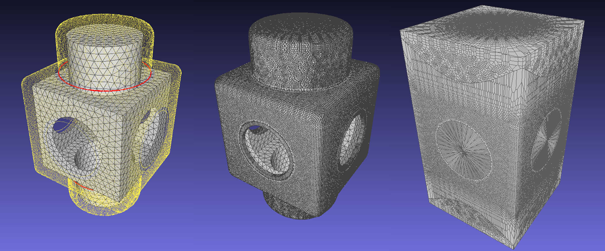

# Power-diagram-generator

`PowerDiagramGenerator` is a lightweight and user-friendly program for computing or visualizing the Power/Voronoi diagram of the input (weighted) point cloud, to facilitate subsequent tasks such as rendering or reconstruction.

This program directly performs the half-plane cutting process of a polyhedra cell, and primarily relies on CPU-based computations. The data structures used in this program are partially derived from:

> Nicolas Ray, Dmitry Sokolov, Sylvain Lefebvre, and Bruno Lévy. 2018. Meshless voronoi on the GPU. ACM Trans. Graph. 37, 6, Article 265 (December 2018), 12 pages. https://doi.org/10.1145/3272127.3275092

If there are any bugs or feedback, please let me know.
## Dependencies
All dependencies are listed below:
- [nanoflann](https://github.com/jlblancoc/nanoflann) (already included)
---
## Building
In root directory:
```
mkdir build
cd build
cmake ..
make
```
---
## Usage
A command-line executable is provided, which reads in an `.xyz` file and generates either the power cell connection relationships or some visualizable `.obj` file.

For example (result in the teaserfigure, the default read and write paths are set to `/data/`):
```
./build/bin/release/PowerDiagramGenerator -r=0.01 -v=p TEST.xyz
./build/bin/release/PowerDiagramGenerator -r=0.001 --b -v=p TEST.xyz
```
More usage instructions can be obtained by using the `--help` command:

```
OPTIONS:
    --bounding|--box|--b: initialize the initial box for each point as the bounding box of the entire point cloud
    --exact|--e: completely exactly compute the power diagram, it may result in an increase in computational overhead, only for verification
    --help|--h: show this help
    -output|-o=[OUTPUT_TYPE]: generate the output of the power diagram in the form of the specified data type
        OUTPUT_TYPE:
            neighbor|n: the neighbors information between points
    -path|-op|-p=[string]: set the output path [default ..//..//data//]
    -radius|-r=[double]: set the radius of the initial box for each point [default 0]
    --timecount|--tc|--t: Output the time count information
    --voronoi|--vor|--v: compute the voronoi diagram
    -visual|-vis|-v=[VISUAL_TYPE]: generate the visual output of the power diagram in the form of the specified data type.obj
        VISUAL_TYPE:
            connection|c: the connection relationships between points
            polyhedron|p: the polyhedron of power cells
            wireframe|wire|w: the wireframe of power cells
```

### File format
Support point cloud input formats including `.obj`, `.off`, `.xyz`. It is worth noting that only the `.xyz` format supports input of weighted point cloud, with the format as follows:
```
x1 y1 z1 w1
x2 y2 z2 w2
...
```

The visualized output files are `.obj` format, these can be imported into rendering softwares which support n-gon polygon operations.

The output result information is a `.txt` file, which contains the information about the neighboring points for the power cell of each point. The output format is as follows:
```
0 point(0)'s neighbors(0) point(0)'s neighbors(1) point(0)'s neighbors(2) ...
1 point(1)'s neighbors(0) point(1)'s neighbors(1) point(1)'s neighbors(2) ...
...
```